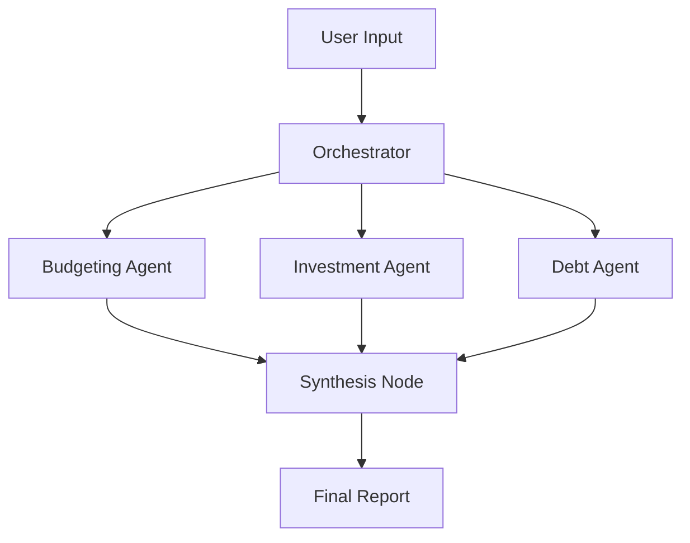

#  AI Financial Advisory Multi-Agent System

A production-ready financial planning platform powered by three specialized AI agents orchestrated with LangGraph. Get personalized budgeting, investment, and debt management advice tailored to your unique financial situation.


---

##  Overview

This system employs three expert AI agents working in parallel to analyze your financial profile and deliver comprehensive, actionable advice:

| Agent | Role | Expertise | Output |
|-------|------|-----------|--------|
|  **Budgeting Agent** | Senior Budgeting Advisor | 15+ years in personal finance | Monthly budget breakdown, spending optimization, savings recommendations |
|  **Investment Agent** | Chief Investment Strategist | CFA charterholder, multi-asset class | Risk assessment, asset allocation (stocks/bonds), ETF recommendations |
|  **Debt Management Agent** | Certified Credit Counselor | Debt reduction specialist | Repayment strategies, interest savings, credit improvement plans |

---

##  Key Features

###  **Multi-Agent Architecture**
- **Sequential Processing**: Budgeting → Investment → Debt Management → Synthesize
- **LangGraph Orchestration**: Sophisticated workflow management with state tracking
- **Factory Pattern**: Clean, extensible agent creation system
- **Smart Synthesis**: Prioritizes cross-cutting actions from all agents

###  **Intelligent Analysis**
- **Age-Based Allocation**: Investment recommendations using "110 - age" rule
- **Debt Payoff Calculator**: Precise timeline and interest savings projections
- **Risk-Adjusted Portfolios**: Conservative/Moderate/Aggressive allocations
- **Emergency Fund Sizing**: Automatic 3-6 month expense calculations

###  **Production-Ready**
- **Pydantic Validation**: Type-safe inputs with automatic validation
- **Error Handling**: Graceful degradation if agents fail
- **Comprehensive Testing**: 15+ unit tests with pytest
- **Secure API Keys**: Environment variables or secure UI input

###  **User-Friendly Interface**
- **Gradio Web UI**: Beautiful, intuitive interface
- **Real-Time Validation**: Instant feedback on inputs
- **Copy-to-Clipboard**: Easy report sharing
- **Mobile Responsive**: Works on all devices

---

##  Quick Start

### Prerequisites

```bash
Python 3.9+
OpenAI API Key (get one at https://platform.openai.com)
```

### Installation

```bash
# Clone the repository
git clone https://github.com/yourusername/financial-advisor-ai.git
cd financial-advisor-ai

# Create virtual environment
python -m venv venv
source venv/bin/activate  # On Windows: venv\Scripts\activate

# Install dependencies
pip install -r requirements.txt
```

### Configuration

```bash
# Option 1: Environment variable (recommended)
export OPENAI_API_KEY="sk-your-api-key-here"

# Option 2: Create .env file
echo "OPENAI_API_KEY=sk-your-api-key-here" > .env
```

### Run the Application

```bash
python app.py
```

The application will launch at `http://localhost:7860`

---

##  Usage Guide

### Input Your Financial Profile

1. **Income & Expenses**
   - Monthly Income: Your total monthly income after taxes
   - Monthly Expenses: Regular monthly spending
   
2. **Debt Information**
   - Total Debt: Sum of all debts (credit cards, loans, etc.)
   - Average Interest Rate: Weighted average of all debt rates

3. **Savings & Goals**
   - Current Savings: Total liquid savings
   - Age: Used for retirement and investment planning
   - Financial Goals: Specific objectives (house, retirement, etc.)

4. **Investment Profile**
   - Experience Level: Beginner, Intermediate, or Advanced
   - Risk Tolerance: Conservative, Moderate, or Aggressive

### Understanding Your Report

The system generates a comprehensive report with four sections:

####  **Budgeting Analysis**
- **50/30/20 Budget Breakdown**: Needs, wants, and savings allocation
- **Key Metrics**: Savings rate, disposable income, emergency fund target
- **Action Items**: Specific steps to improve financial health

####  **Investment Strategy**
- **Asset Allocation**: Recommended stock/bond split based on age and risk
- **Investment Vehicles**: Specific ETFs and index funds (VTI, VXUS, etc.)
- **Tax-Advantaged Accounts**: 401k, IRA, and Roth IRA strategies
- **Action Items**: Brokerage setup, contribution schedules

####  **Debt Management**
- **Repayment Strategy**: Avalanche method (highest interest first)
- **Payment Schedule**: Monthly payment recommendations
- **Debt-Free Timeline**: Projected payoff date with interest savings
- **Credit Tips**: Strategies to improve credit score

####  **Priority Actions**
- Top 5 most impactful steps across all areas
- Ranked by urgency and financial impact

---

## 🏗️ Architecture

### System Components

```
financial-advisor-ai/
├── config.py                 # Pydantic models and enums
├── agents/
│   ├── base_agent.py        # Abstract base class
│   ├── budgeting_agent.py   # Budgeting specialist
│   ├── investment_agent.py  # Investment strategist
│   ├── debt_management_agent.py  # Debt counselor
│   └── factory.py           # Agent factory pattern
├── orchestrator.py          # LangGraph workflow orchestration
├── app.py                   # Gradio frontend
├── tests/
│   └── test_agents.py       # Comprehensive test suite
├── requirements.txt
└── README.md
```

### Agent Architecture



### LangGraph Workflow

```python
Entry Point
    ↓
Budgeting Agent (parallel)
    ↓ ↘
Investment Agent ← Debt Management Agent
    ↓ ↙
Synthesis Node
    ↓
Final Report (END)
```

---

##  Testing

### Run All Tests

```bash
pytest tests/test_agents.py -v
```

### Run Specific Test Categories

```bash
# Test agent factory
pytest tests/test_agents.py::TestAgentFactory -v

# Test budgeting agent
pytest tests/test_agents.py::TestBudgetingAgent -v

# Test investment calculations
pytest tests/test_agents.py::TestInvestmentAgent -v

# Test debt management
pytest tests/test_agents.py::TestDebtManagementAgent -v

# Test orchestrator
pytest tests/test_agents.py::TestOrchestrator -v
```

### Test Coverage

```bash
pytest --cov=. --cov-report=html tests/
```

---

##  Advanced Configuration

### Custom Agent Parameters

```python
# Modify agent temperature for more creative/conservative responses
agent = BudgetingAgent(api_key="your-key", model="gpt-4", temperature=0.5)
```

### Add Custom Agents

1. Create new agent class inheriting from `BaseFinancialAgent`
2. Implement `get_system_prompt()` and `analyze()` methods
3. Add to `AgentFactory` agents dictionary
4. Update `AgentType` enum in `config.py`

```python
class TaxPlanningAgent(BaseFinancialAgent):
    def get_system_prompt(self) -> str:
        return "You are a certified tax strategist..."
    
    def analyze(self, user_profile: UserProfile) -> AgentResponse:
        # Implementation
        pass
```

### Customize Orchestration Flow

Modify the graph in `orchestrator.py`:

```python
# Add conditional edges
workflow.add_conditional_edges(
    "budgeting",
    should_run_investment,
    {
        "yes": "investment",
        "no": "synthesize"
    }
)
```

---

##  Example Use Cases

### Case 1: Young Professional
**Profile**: 28 years old, $65K income, $15K student loans
**Result**: Aggressive 85/15 portfolio, 3-year debt payoff plan, emergency fund strategy

### Case 2: Mid-Career Family
**Profile**: 45 years old, $120K income, mortgage, kids' education savings
**Result**: Balanced 65/35 portfolio, 529 plan recommendations, retirement catch-up strategy

### Case 3: Pre-Retirement Planning
**Profile**: 58 years old, $200K income, $500K savings
**Result**: Conservative 55/45 portfolio, tax-efficient withdrawal strategy, estate planning tips

---

##  Troubleshooting

### Common Issues

**Issue**: "OpenAI API Key Error"
```bash
# Solution: Check your API key
echo $OPENAI_API_KEY  # Should display your key
# Or set it in the UI directly
```

**Issue**: "Module not found"
```bash
# Solution: Reinstall dependencies
pip install --upgrade -r requirements.txt
```

**Issue**: "Rate limit exceeded"
```bash
# Solution: Add rate limiting or use GPT-3.5-turbo
agent = BudgetingAgent(api_key=key, model="gpt-3.5-turbo")
```

**Issue**: "Gradio not launching"
```bash
# Solution: Specify port manually
app.launch(server_port=7860, share=False)
```

---

##  Security Best Practices

1. **Never commit API keys** to version control
2. **Use environment variables** for sensitive data
3. **Implement rate limiting** for production deployments
4. **Validate all user inputs** (already implemented with Pydantic)
5. **Use HTTPS** when deploying publicly

---

##  Performance Optimization

### Speed Improvements
- **Parallel Agent Execution**: ~3x faster than sequential
- **Response Caching**: Cache LLM responses for repeat queries
- **Batch Processing**: Process multiple users simultaneously

### Cost Optimization
```python
# Use GPT-3.5-turbo for cost savings
agents = AgentFactory.create_all_agents(api_key, model="gpt-3.5-turbo")

# Reduce token usage
llm = ChatOpenAI(model="gpt-4", max_tokens=500)
```

---

## 🤝 Contributing

We welcome contributions! Please follow these steps:

1. Fork the repository
2. Create a feature branch (`git checkout -b feature/amazing-feature`)
3. Commit your changes (`git commit -m 'Add amazing feature'`)
4. Push to the branch (`git push origin feature/amazing-feature`)
5. Open a Pull Request

### Development Guidelines
- Follow PEP 8 style guide
- Add tests for new features
- Update documentation
- Keep commits atomic and descriptive

---

##  Roadmap

- [ ] **Additional Agents**: Tax planning, insurance analysis, estate planning
- [ ] **Multi-language Support**: Spanish, French, German translations
- [ ] **Data Persistence**: Save user profiles and historical reports
- [ ] **Visualization Dashboard**: Charts and graphs for financial metrics
- [ ] **Mobile App**: Native iOS/Android applications
- [ ] **Integration APIs**: Connect to Plaid, Mint, Personal Capital
- [ ] **Real-time Market Data**: Live stock quotes and portfolio tracking
- [ ] **PDF Report Generation**: Professional-looking downloadable reports

---

## 📜 License

This project is licensed under the MIT License - see the [LICENSE](LICENSE) file for details.

---

## 🙏Acknowledgments

- **LangChain** for the powerful LLM framework
- **LangGraph** for sophisticated agent orchestration
- **Gradio** for the beautiful UI components
- **OpenAI** for GPT-4 API
- **Anthropic** for Claude (alternative LLM support coming soon)

---


## 🎓 Learning Resources

### For Beginners
- [LangChain Documentation](https://python.langchain.com/docs/get_started/introduction)
- [LangGraph Tutorial](https://langchain-ai.github.io/langgraph/)
- [Gradio Quick Start](https://www.gradio.app/guides/quickstart)

### Advanced Topics
- [Multi-Agent Systems](https://python.langchain.com/docs/use_cases/more/agents/)
- [Prompt Engineering](https://platform.openai.com/docs/guides/prompt-engineering)
- [Financial Planning Fundamentals](https://www.cfp.net/)

---

**Last Updated**: November 2025  
**Version**: 1.0.0  
